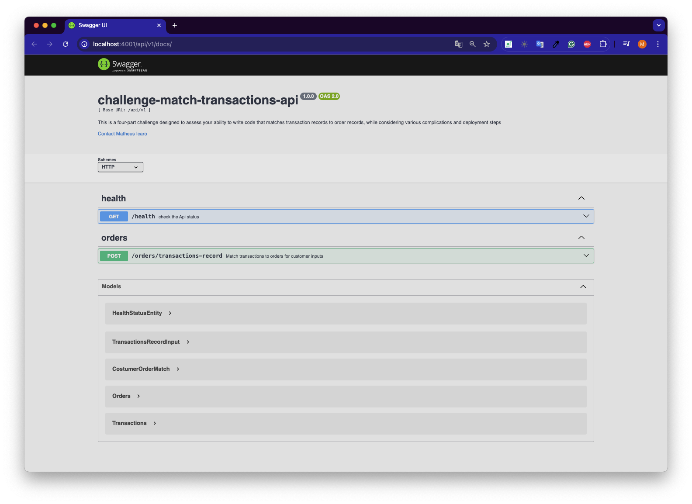

# challenge-match-transactions-api

Summary:

- [challenge-match-transactions-api](#challenge-match-transactions-api)
- [Introduction](#introduction)
- [How to run the API](#how-to-run-the-api)
- [API specifications](#api-specifications)

 
 

# Introduction

This is a challenge to design a API to return costumers orders and transactions records.
This API should be able to handle with large datasets, and provide flexibility in matching logic, and allow for user involvement in verifying the matches.

The task is broken down into four parts to solve a matching problem involving transaction and order records.
For each part, an issue was created a issue:

- Part 1: Basic Matching of Orders and Transactions: [issues #1](https://github.com/matheusicaro/challenge-transactions-api/issues/1)
- Part 2: Handling Data Mistakes: [issues #6](https://github.com/matheusicaro/challenge-transactions-api/issues/6)
   - **Task completed in:** [_pull-request/handling data mistakes #9_](https://github.com/matheusicaro/challenge-transactions-api/pull/9)
- Part 3: Web App Deployment: [issues #7](https://github.com/matheusicaro/challenge-transactions-api/issues/7)
- Part 4: Approval Workflow: [issues #8](https://github.com/matheusicaro/challenge-transactions-api/issues/8)

 
 

# How to run the API

1. Clone this repository
2. rename [.env-example](https://github.com/matheusicaro/challenge-transactions-api/blob/master/.env-example) file to to `.env`
3. In the root folder run: `npm install`
4. Then run: `npm start`
5. Go to API docs: http://localhost:4001/api/v1/docs/
  

 📸 Running local

https://github.com/user-attachments/assets/c42ee20a-d901-4806-9247-a6cc8f041944

 
 

# API specifications

The service use a [hexagonal-architecture](https://docs.aws.amazon.com/prescriptive-guidance/latest/cloud-design-patterns/hexagonal-architecture.html) with the definition of Ports and Adapters for the providers.

- Used **[Node.js](https://nodejs.org/en/)** with:
  - **[TypeScript](https://www.typescriptlang.org/)**
  - **[express](https://expressjs.com/)**
- Used **[Jest](https://jestjs.io/)** for unit testing
- Used **[Husky](https://typicode.github.io/husky/#/)** for running defined steps/scripts before make a commit, script at: ['.husky/pre-commit'](./.husky/pre-commit)
